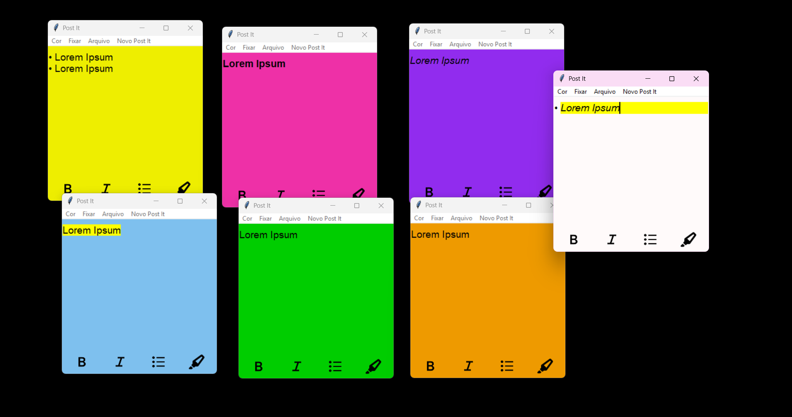

# 📝 Post It - Editor de Texto com Formatação (Tkinter)

Um pequeno editor de notas feito com Python e Tkinter, com suporte a formatação de texto (negrito, itálico, destaque de linha, marcadores) e salvamento de arquivos `.txt`.

## ✨ Funcionalidades

- Interface simples e colorida com fundo aleatório
- Negrito (`N`) e Itálico (`I`) aplicáveis à seleção de texto
- Adição de marcadores (`•`)
- Destaque de linha com fundo amarelo (`H`)
- Salvar, carregar notas e deletar
- Extrair conteúdo em arquivo `.txt`
- Fixar janela

## 🚀 Download

Baixe a versão mais recente em [Releases](https://github.com/LeticiaParreiras/postit/releases)

# Preview


## 🛠️ Desenvolvimento
Clone o repositório:

```
git clone https://github.com/LeticiaParreiras/postit
cd postit
python main.py
```
### Criar Executável

```
pip install -U pyinstaller
pyinstaller --onefile --noconsole --add-data "assets/images;assets/images" --icon=notas.ico --name="Post It" main.py
```

## 🤝 Contribuindo
Contribuições são bem-vindas! Sinta-se livre para solicitar pull request ou abrir uma issue!

## 📝 Licença
Este projeto está licenciado sob a MIT License

## 👨‍💻 Autor
Desenvolvido com ❤️ por Leticia Parreiras